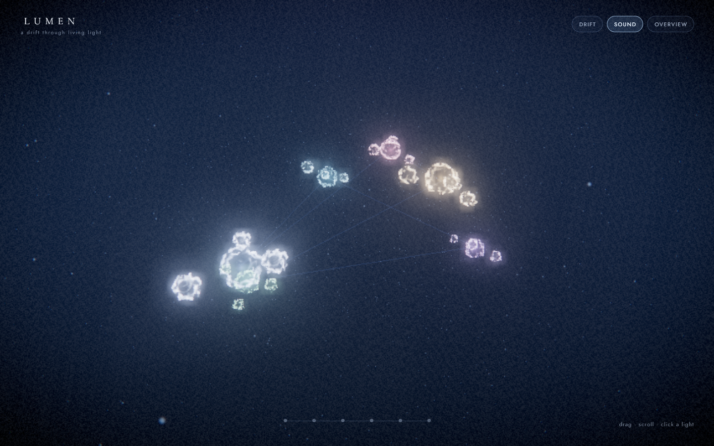

# LUMEN — a drift through living light

An immersive, real-time WebGL art piece. Six organic light-forms drift in a dark field, connected by faint strands of light. You travel between them — and each one answers with a shift in colour, a swell of sound, and a line of text.

**Live → <https://lumen-rouge-eight.vercel.app>**



Built as a single, dependency-free `index.html` — no build step, no bundler, no framework.

---

## The experience

- **Travel the constellation.** Click any light — or use the nav, number keys, or arrow keys — and the camera glides through space to it.
- **Arrival is the moment.** Each destination answers with an expanding ring, a bloom of its halo, a tuned chord, and its line of text. This is the one authored motion beat; everything else stays quiet around it.
- **The world reacts to you.** Light-forms drift toward your cursor when you come near, and a soft light follows the pointer through the void.
- **Speed is felt, not told.** In transit the field of view opens up and the starfield stretches, so moving through space has weight.
- **Six voices.** Every light has its own hue, its own pad chord, and its own fragment of text.
- **Hands-free.** `Drift` runs a slow cinematic tour through all six lights; any interaction takes back control.

## Controls

| Input | Action |
| --- | --- |
| Drag | Orbit the current light |
| Scroll | Change distance |
| Click a light / nav dot | Travel to it |
| `1`–`6` | Travel to a light |
| `←` / `→` | Previous / next light |
| `D` | Toggle the auto-drifting tour |
| `R` | Pull back to the full overview |
| `M` | Mute / unmute |

## How it works

- **Three.js** (r160) loaded as ES modules from a CDN via an import map — nothing is bundled or installed.
- **Organic forms.** Highly subdivided icospheres are displaced in a custom GLSL vertex shader using 3D simplex noise, with normals recomputed from finite differences so the surface shades correctly as it breathes and morphs.
- **Light, not geometry.** The forms are additively blended, with a fresnel rim, a soft halo sprite, a bright core, and a pulsing arrival ring.
- **Post-processing chain:** `RenderPass → UnrealBloomPass → FXAA → grade → OutputPass`. The custom *grade* pass adds chromatic aberration, a vignette, film grain, and a saturation lift; `OutputPass` applies ACES Filmic tone mapping and colour-space conversion.
- **Sound** is synthesised live with the Web Audio API: a low drone, a per-light pad chord that glides between destinations, and a chime on arrival. No audio files.
- **Camera** is a damped orbital rig with idle auto-drift; travel, zoom, and look are all exponential ease-out.

## Performance

Immersive WebGL lives or dies on frame budget, so the piece defends its own:

- **Adaptive resolution.** Frame times are sampled over 1.5 s windows; if the average drops below ~45 fps the render scale steps down, and it climbs back when there is headroom. The pixel ratio is capped at 1.5.
- **Cheap bloom.** The bloom pass renders at 60% of the already-reduced resolution.
- **One pass, many effects.** Grain, aberration, vignette, and saturation share a single full-screen pass instead of stacking several.
- **No per-frame allocation** in the hot loop, and rendering pauses when the tab is hidden.
- **Reduced-motion aware.** Particle density and idle motion respect `prefers-reduced-motion`.

## Run locally

It is one static file, so opening `index.html` directly works. A local server is recommended:

```bash
python -m http.server 8080
# or
npx serve .
```

Then open <http://localhost:8080>.

## Deploy

Hosted on Vercel as a static site — no build configuration required.

```bash
vercel link --project lumen
vercel --prod
```

## Project structure

```
index.html    the entire experience (markup, styles, shaders, audio, logic)
preview.png   preview image
LICENSE       MIT
```

## License

MIT — see [LICENSE](LICENSE).
